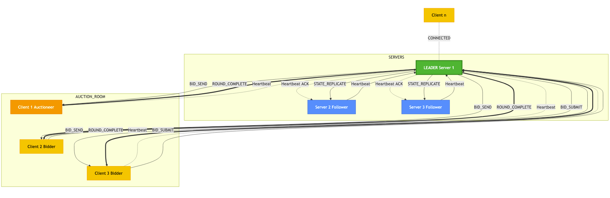

# Agora
## Distributed Auction System

A fault-tolerant distributed auction system built with Python, featuring leader election, state replication, and multi-round bidding.

---

## Architecture



---

## Features

### Distributed Systems Concepts

| Feature | Implementation |
|---------|----------------|
| **Leader Election** | Bully Algorithm |
| **Replication** | Passive (Primary-Backup) |
| **Message Ordering** | Total Ordering via Centralized Sequencer |
| **Fault Tolerance** | Crash faults |
| **Recovery** | Checkpoint-based with in-memory replication |
| **Communication** | UDP Unicast + UDP Broadcast |

### Auction Features

- Multi-round sealed-bid auctions
- Multiple concurrent auctions
- Winner determination based on cumulative bids

---

## Project Structure

```
Agora/
├── server.py                 # Server entry point
├── client.py                 # Client entry point
├── constants.py              # Configuration constants
├── auction/
│   ├── server_auction_manager.py   # Server-side auction logic
│   └── client_auction_manager.py   # Client-side auction logic
├── election/
│   └── election_manager.py   # Bully election algorithm
├── replication/
│   └── state_replication_manager.py  # Primary-backup replication
├── snapshots/
│   └── snapshots_manager.py  # Checkpoint/snapshot management
├── heartbeat/
│   └── hearbeat.py           # Failure detection
├── discovery/
│   └── discovery_handler.py  # Peer discovery
├── broadcast/
│   └── broadcast.py          # UDP broadcast
├── udp/
│   └── udp.py                # UDP unicast/multicast
├── messages/
│   ├── server_messages_manager.py  # Server message handling
│   └── client_messages_manager.py  # Client message handling
└── util/
    ├── request_response_handler.py # Message construction
    ├── network_util.py       # Network utilities
    └── uuid_util.py          # UUID generation
```

---

## Getting Started

### Prerequisites

- Python 3.10+
- Required packages: `loguru`, `termcolor`

### Installation

```bash
pip install -r requirements.txt
```

### Running the System

**1. Start Server(s)**

Start multiple servers (each in a separate terminal):

```bash
python server.py
```

The first server will become the leader. Additional servers become followers.

**2. Start Client(s)**

```bash
python client.py
```

Clients will automatically discover the leader and can participate in auctions.

---

## Auction Flow

### 1. Create Auction
An auctioneer creates an auction with:
- Item name
- Minimum bid price
- Minimum number of rounds
- Minimum number of bidders

### 2. Join Auction
Bidders list available auctions and join one.

### 3. Bidding Rounds
```
ROUND_START ──► Participants submit BID_SUBMIT
                        │
                        ▼
              Leader sends BID to all bidders
                        │
                        ▼
              All bids received ──► ROUND_COMPLETE
                        │
                        ▼
              Repeat until min_rounds reached
```

### 4. Winner Determination
Winner = participant with highest **cumulative bid** across all rounds.

---

## Configuration

Key parameters in `constants.py`:

| Parameter | Default | Description |
|-----------|---------|-------------|
| `BROADCAST_PORT` | 12345 | UDP broadcast port for discovery |
| `HEART_BEAT_INTERVAL` | 20s | Heartbeat frequency |
| `HEART_BEAT_TIMEOUT` | 60s | Time before node considered failed |
| `MAX_MISSED_HEART_BEATS` | 2 | Missed ACKs before triggering election |
| `REPLICATION_INTERVAL` | 5s | State replication frequency |
| `AUCTION_START_TIMEOUT` | 60s | Time for auctioneer to confirm start |

---

## Message Types

### Discovery & Election
| Message | Description |
|---------|-------------|
| `DISCOVERY_REQUEST` | Broadcast to find peers |
| `DISCOVERY_RESPONSE` | Response with server details |
| `LEADER_ELECTION_REQUEST` | Bully election initiation |
| `LEADER_ELECTION_COORDINATION_REQUEST` | Leader announcement |

### Heartbeat & Replication
| Message | Description |
|---------|-------------|
| `HEART_BEAT` | Liveness check |
| `HEART_BEAT_ACK` | Heartbeat acknowledgment |
| `STATE_REPLICATE` | Full state replication to backups |

### Auction Operations
| Message | Description |
|---------|-------------|
| `AUCTION_CREATE_REQUEST` | Create new auction |
| `AUCTION_JOIN_REQUEST` | Join existing auction |
| `AUCTION_START` | Auction begins |
| `ROUND_START` | New bidding round |
| `BID_SUBMIT` | Submit bid (client → leader) |
| `BID_BROADCAST` | Broadcast bid (leader → all) |
| `ROUND_COMPLETE` | Round finished with all bids |
| `AUCTION_WINNER` | Notify winner |
| `AUCTION_LOSER` | Notify non-winners |

---

## Fault Tolerance

### Handled Faults

| Fault Type | Detection | Recovery |
|------------|-----------|----------|
| **Leader crash** | Heartbeat timeout (>2 missed) | Bully election, state restoration |
| **Follower crash** | Heartbeat timeout (60s) | Marked as failed |
| **Message loss** | Bid retransmission | `BID_SUBMIT_RETRANSMIT` |

### Recovery Strategy

1. **Primary mechanism**: In-memory replicated state from leader
2. **Post-recovery**: Notify clients, resume active auctions

---

## Group View

| View | Maintained By | Purpose |
|------|---------------|---------|
| `discovered_servers` | All servers | Replication, election |
| `discovered_clients` | Leader only | Auction operations |

---

## Limitations

- No Byzantine fault tolerance
- UDP-based (no guaranteed delivery for most messages)
- Single leader bottleneck

---

## License

MIT License
